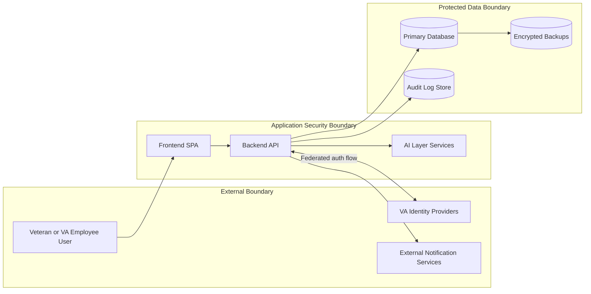

# System Boundary Diagram

Date: 2026-07-04
Scope: High-level boundary model for security, integration, and compliance planning.

## Boundary Model

## Trust Boundaries

- Boundary 1: User device to frontend and API endpoints over TLS.
- Boundary 2: Application services to protected data stores.
- Boundary 3: Platform to external providers (identity, notifications).

## Security Expectations per Boundary

| Boundary | Core Controls |
| --- | --- |
| User to App | TLS, secure session handling, auth token validation |
| App to Data | Service authorization, least privilege DB access, query auditing |
| App to External | Outbound allowlist, signed requests where supported, timeout/retry controls |

## Boundary Artifacts to Maintain

- Data flow inventory by endpoint and data classification.
- Interface control definitions for each external dependency.
- Network and firewall rule documentation by environment.
- Boundary change log linked to architecture decision records.
